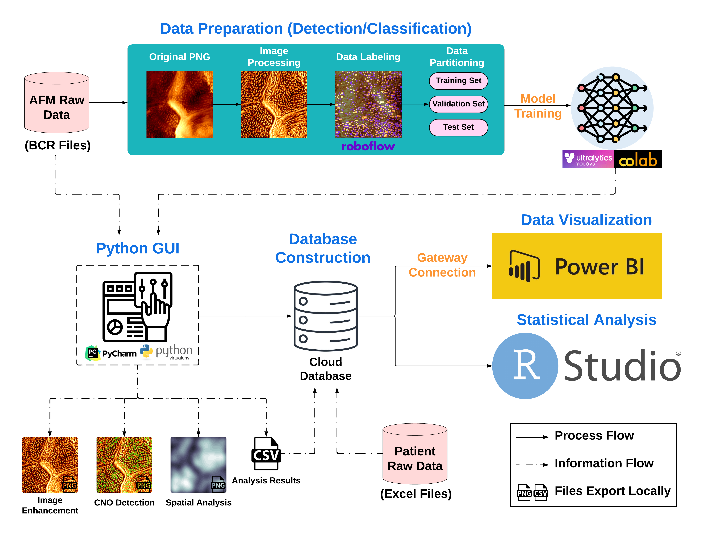

# **Stratum corneum nanotexture feature detection using deep learning and spatial analysis: a non-invasive tool for skin barrier assessment**



This repository presents an objective, quantifiable method for assessing atopic dermatitis (AD) severity. The program integrates deep learning object detection with spatial analysis algorithms to accurately calculate the density of circular nano-size objects (CNOs), termed the Effective Corneocyte Topographical Index (ECTI). The ECTI demonstrates remarkable robustness in overcoming the inherent challenges of nano-imaging, such as environmental noise and structural occlusions on the corneocyte surface, further enhancing its applicability in clinical settings.

## **Dependencies**
- Python 3.9+
- matplotlib
- numpy
- opencv-python
- scipy
- scikit-image
- ultralytics
- scikit-learn
- customtkinter

## **Directories**
- `AD_Assessment_GUI.zip` contains a cross-platform executable GUI, sample data, and a tutorial video.
- `utils/Img_Preprocessing.py` demonstrates the image enhancement algorithms applied to the corneocyte nanotexture images.

## **Usage**
1. Execution via cross-platform executable GUI
    - Download [AD_Assessment_GUI.zip](https://huggingface.co/jenhung/ECTI_Assessment_GUI)
    - Run `AD_Assessment_GUI.exe`
    - Analysis results will be saved within the selected path in a folder titled `CNO_Detection`

2. Execution via python script
    - Install packages in terminal:
        ```    
        pip install -r requirements.txt
        ```
    - Run `AD_Assessment_GUI.py`
    - Analysis results will be saved within the selected path in a folder titled `CNO_Detection`

## **Executable**

1. Install PyInstaller in terminal:
                
    ```    
    pip install pyinstaller
    ```
   
2. Run command in terminal:

    ```    
    pyinstaller --onedir .\AD_Assessment_GUI.py
    ```
   
## **Performance**

| Model                                                                | Test Size | #Parameter (M) | FLOPs (G) | AP<sup>50</sup> (%) | AP<sup>50-95</sup> (%) | Latency (ms) |
|:---------------------------------------------------------------------|:---------:|:--------------:|:---------:|:-------------------:|:----------------------:|:------------:|
| [YOLOv10-N](https://huggingface.co/jenhung/CNO_DETECTION_YOLOv8-L)   |    512    |      2.7       |    8.2    |        89.6         |          51.4          |     3.3      |
| [YOLOv10-S](https://huggingface.co/jenhung/CNO_DETECTION_YOLOv8-L)   |    512    |      8.0       |   24.4    |        90.8         |          55.5          |     4.58     |
| [YOLOv10-M](https://huggingface.co/jenhung/CNO_DETECTION_YOLOv8-L)   |    512    |      16.5      |   63.4    |        91.3         |          59.7          |     7.17     |
| [YOLOv10-B](https://huggingface.co/jenhung/CNO_DETECTION_YOLOv8-L)   |    512    |      20.4      |   97.7    |        91.1         |          62.5          |     7.58     |
| [YOLOv10-L](https://huggingface.co/jenhung/CNO_DETECTION_YOLOv8-L)   |    512    |      25.7      |   126.3   |        91.4         |          63.2          |     9.01     |
| [YOLOv10-X](https://huggingface.co/jenhung/CNO_DETECTION_YOLOv8-L)   |    512    |      31.6      |   169.8   |        91.2         |          62.9          |    10.95     |
| [RT-DETRv2-S](https://huggingface.co/jenhung/CNO_DETECTION_YOLOv8-L) |    512    |      20.0      |   60.0    |        87.6         |          39.6          |     5.51     |
| [RT-DETRv2-M](https://huggingface.co/jenhung/CNO_DETECTION_YOLOv8-L) |    512    |      31.0      |   100.0   |        84.0         |          37.2          |     7.48     |
| [RT-DETRv2-L](https://huggingface.co/jenhung/CNO_DETECTION_YOLOv8-L) |    512    |      42.0      |   136.0   |        84.3         |          33.4          |    13.50     |
| [RT-DETRv2-X](https://huggingface.co/jenhung/CNO_DETECTION_YOLOv8-L) |    512    |      76.0      |   259.0   |        83.3         |          32.0          |    21.15     |

## **Dataset**
The corneocyte nanotexture dataset is available for download at the following link: [Corneocyte Nanotexture Dataset](https://huggingface.co/datasets/jenhung/Corneocyte_Nanotexture_Dataset).

## **Contributions**

[1] Wang, J-H., Pereda, J., Du, C-W., Chu, C-Y., Christensen, M. O., Kezic S., Jakasa I., Thyssen J. P., Satheesh S., Hwu, E. E-T. (2024). Stratum corneum nanotexture feature detection using deep learning and spatial analysis: a non-invasive tool for skin barrier assessment. *GigaScience* [In Revision, Submitted on 27. March 2024]

[3] de Boer, F. L., van der Molen, H. F., Wang, J-H., Raun, E., Pereda, J., Hwu, EE. -T., Jakasa, I., Dubrac, S., Rustemeyer, T., & Kezic, S. (2024). Skin Barrier and Immune Response related Biomarkers of Solar UVR Exposure comparing Indoor and Outdoor Workers. *JID Innovations*, Article 100280. https://doi.org/10.1016/j.xjidi.2024.100280

[4] Liao, H. S., Akhtar, I., Werner, C., Slipets, R., Pereda, J., Wang, J. H., Raun, E., Nørgaard, L. O., Dons, F. E., & Hwu, E. E. T. (2022). Open-source controller for low-cost and high-speed atomic force microscopy imaging of skin corneocyte nanotextures. *HardwareX*, 12, [e00341]. https://doi.org/10.1016/j.ohx.2022.e00341

----

### Contact: [Jen-Hung Wang](mailto:jenhw@dtu.dk) / [Assoc. Professor En-Te Hwu](mailto:etehw@dtu.dk)
